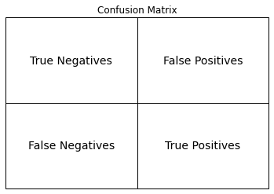
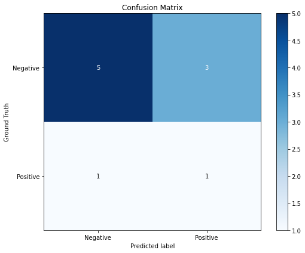

# Key-Evaluation-Metrics

Machine Learning metrics are tools used to measure how well a machine learning model is performing. They provide information about the model's accuracy, precision, recall, and other important aspects. By analyzing these metrics, we can understand how good the model is at making predictions and make improvements if needed. ML metrics help us evaluate and compare different models to choose the best one for a particular task.

### Let's examine metrics evaluation in the context of medical diagnostic evaluation.

Assuming we want to classify patients with and without a disease.

We have our True labels(GroundTruth) `[0,0,0,0,0,1,0,1,0,0]` and Model Predictions `[0,0,0,1,0,0,1,1,1,0]`

.jpg)


```python
import pandas as pd
import numpy as np

GroundTruth = np.array([0,0,0,0,0,1,0,1,0,0])
Prediction =  np.array([0,0,0,1,0,0,1,1,1,0])

print("GroundTruth:", GroundTruth)

print('\n')

print("Prediction:", Prediction)
```

    GroundTruth: [0 0 0 0 0 1 0 1 0 0]
    
    
    Prediction: [0 0 0 1 0 0 1 1 1 0]
    

We will start by looking at different metrics and how to calculate them.


### 1. Accuracy
   Accuracy measures the proportion of correct predictions made by the model.

   Out of a all disease examples, How many were correctly classified.


```python
accuracy = np.sum(GroundTruth == Prediction)/len(GroundTruth)

print("Accuracy:", accuracy)
```

    Accuracy: 0.6
    

From a statistical standpoint, we can view Accuracy as the probability of the the model being correct.

$Accuray = P(correct)$

which can be broken down further into the the sum of two Probabilities. 

Probability of the model being correct given that a patient has a disease, and the probability of being correct given that a patient has no disease.

$Accuray = P(correct ∩ disease) + P(correct ∩ no\_disease)$


### 2. Precision

Precision calculates the proportion of true positive predictions out of all positive predictions made by the model.

Precision in disease classification calculates the ratio of correctly diagnosed positive cases out of all cases predicted as positive by the model.


```python
true_positives = np.sum((GroundTruth == 1) & (Prediction == 1))
false_positives = np.sum((GroundTruth == 0) & (Prediction == 1))
true_negatives = np.sum((GroundTruth == 0) & (Prediction == 0))
false_negatives = np.sum((GroundTruth == 1) & (Prediction == 0))


precision = true_positives / (true_positives + false_positives)
print("Precision:", precision)
```

    Precision: 0.25
    

### 3. Recall.

Recall in disease classification measures how well the model can correctly find all the people with the disease. It is the ratio of correctly identified positive cases to the total number of actual positive cases in the dataset.


```python

recall = true_positives / (true_positives + false_negatives)
print("Recall:", recall)
```

    Recall: 0.5
    

### 4. F1-score

In disease classification, the F1-score is a balanced evaluation metric that takes into account both precision and recall. It calculates the harmonic mean of precision and recall to provide an overall measure of the model's performance. It ensures a balance between correctly identifying positive cases (precision) and capturing all actual positive cases (recall).


```python
f1 = 2 * (precision * recall) / (precision + recall)
print("F1-Score:",round(f1,2))
```

    F1-Score: 0.33
    

### 5.  Sensitivity

Sensitivity, also known as the true positive rate, measures how well a test detects the disease by correctly identifying positive cases among those who actually have the disease.

In a simple term, If a patient has a disease, what is the probability that our model predicts positive.


```python
sensitivity = true_positives / (true_positives + false_negatives)
print("Sensitivity:", sensitivity)
```

    Sensitivity: 0.5
    

### 6. Specificity 

Specificity also known as the true negative  rate, measures how well a test excludes healthy individuals by correctly identifying negative cases among those who do not have the disease.

In a simple term, If a patient does not have a disease, what is the probability that our model predicts negative.


```python

specificity = true_negatives / (true_negatives + false_positives)
print("Specificity:", specificity)
```

    Specificity: 0.625
    

Using The Law of conditional Probability, we can also expand *Accuracy* to further derive Sensitivity and Specificity.

Remember: $Accuracy = P(correct ∩ disease) + P(correct ∩ no\_disease)$

$equ\_1$ 

Using this Law: $P(A ∩ B) = \frac{P(A | B)}{P(B)}$

We can break *Accuracy* to 

$equ\_2$

Accuracy = $\frac{P(\text{correct | disease})}{P(\text{disease})}$ + $\frac{P(\text{correct | no_disease})}{P(\text{no_disease})}$

&nbsp;&nbsp;&nbsp;&nbsp;&nbsp;&nbsp;&nbsp;&nbsp;&nbsp;&nbsp;&nbsp;&nbsp;&nbsp;&nbsp;&nbsp;&nbsp;&nbsp;&nbsp;&nbsp;&nbsp;&nbsp;&nbsp;&nbsp;&nbsp;&nbsp;&nbsp;&nbsp;&nbsp;&nbsp;&nbsp;<span style="display:inline-block; font-size:1.5em;">&#x2191;</span> &nbsp;&nbsp;&nbsp;&nbsp;&nbsp;&nbsp;&nbsp;&nbsp;&nbsp;&nbsp;&nbsp;&nbsp;&nbsp;&nbsp;&nbsp;&nbsp;&nbsp;&nbsp;&nbsp;&nbsp;&nbsp;&nbsp;&nbsp;&nbsp;&nbsp;&nbsp;&nbsp;&nbsp;&nbsp;&nbsp; <span style="display:inline-block; font-size:1.5em;">&#x2191;</span>

The numerators in the above $equ\_2$ represents Sensitivity(true positive rate) and Specificity(true negative rate), and the first denominator represents *Prevalence*.

Prevalence is simple the probability of a patient having a disease in a population `${P(\text{disease})}$, while  ${P(\text{no\_disease})}$` represents probability of a patient not have a disease.

We can rewrite $equ\_2$ as

$equ\_3$

    Accuracy = Sensitivity * Prevalence + Specificity * (1 -prevalence)

$equ\_3$ allows us to see *Accuracy* as a weighted average of Sensitivity and Specificity. 

therefore, Given all variables except one, we can calculate the missing variable.


```python
sensitivity, specificity = 0.5, 0.625
prevalence = 2/10 #(disease)/#(total cases)


Accuracy = sensitivity * prevalence + specificity * (1 -prevalence)
print("Accuracy derived from Sensitivity, Specificity, and Prevalence :", Accuracy)
```

    Accuracy derived from Sensitivity, Specificity, and Prevalence : 0.6
    

6. #### Confusion Matrix


In simple terms, a confusion matrix is a table that provides a summary of the performance of a classification model. The rows corresponds to the GroundTruth and the columns to model Predictions.

 It shows the number of correct and incorrect predictions made by the model, broken down by class or category. The matrix allows us to assess how well the model is performing in terms of true positives, true negatives, false positives, and false negatives, providing a more detailed understanding of the model's accuracy.


```python


```


    

    


```python
import numpy as np
import matplotlib.pyplot as plt
from sklearn.metrics import confusion_matrix

GroundTruth = np.array([0, 0, 0, 0, 0, 1, 0, 1, 0, 0])
Prediction = np.array([0, 0, 0, 1, 0, 0, 1, 1, 1, 0])

labels = ['Negative', 'Positive']
cm = confusion_matrix(GroundTruth, Prediction)

plt.figure(figsize=(8, 6))  # Set the figure size


plt.imshow(cm, interpolation='nearest', cmap=plt.cm.Blues)
plt.title('Confusion Matrix')
plt.colorbar()
tick_marks = np.arange(len(labels))
plt.xticks(tick_marks, labels)
plt.yticks(tick_marks, labels)

# Labeling the matrix
thresh = cm.max() / 2
for i in range(cm.shape[0]):
    for j in range(cm.shape[1]):
        plt.text(j, i, format(cm[i, j], 'd'),
                 ha="center", va="center",
                 color="white" if cm[i, j] > thresh else "black")

plt.xlabel('Predicted label')
plt.ylabel('Ground Truth')
plt.tight_layout()
plt.show()

```


    

    


There are also other metrics in medical evaluation, such as PPV and NPV, which are the reverse cases of Sensitivity and Specificity.

PPV means that given a model predicts a positive result for a patient, what is the probability that the patient actually has the disease.

NPV means that given a model predicts a negative result for a patient, what is the probability that the patient does not have the disease.
